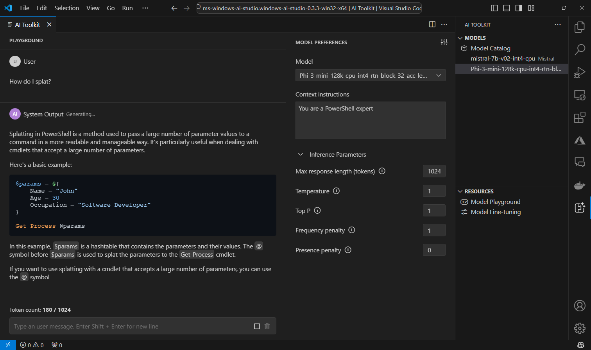

# aitoolkit PowerShell Module

## Overview

The aitoolkit PowerShell module provides a command-line interface for interacting with local AI models through Microsoft's AI Toolkit for Visual Studio Code.

## Background: AI Toolkit for Visual Studio Code

The [AI Toolkit for Visual Studio Code](https://marketplace.visualstudio.com/items?itemName=ms-windows-ai-studio.windows-ai-studio) is an extension that facilitates working with AI models locally. Key features include:

- Browsing and downloading models from catalogs like Azure AI Studio and Hugging Face
- Local model inference
- Model fine-tuning capabilities

Under the hood, the AI Toolkit uses the Kestrel web server to provide a local API endpoint, which this PowerShell module interacts with.



## Introduction

This PowerShell module wraps functionality provided by the AI Toolkit for Visual Studio Code, allowing users to:

- Start and stop the AI Toolkit server
- Load and unload AI models
- Interact with loaded models for text generation
- Manage model configurations

It's designed to make AI model interactions accessible to PowerShell users, whether for experimentation, learning, or integration into existing PowerShell workflows.

## Getting Started

1. Install the AI Toolkit for Visual Studio Code extension
2. Install this PowerShell module:
   ```powershell
   Install-Module -Name aitoolkit
   ```
3. Start the AI Toolkit server:
   ```powershell
   Start-AITServer
   ```
4. Load a model:
   ```powershell
   Mount-AITModel -Model "model-name"
   ```
5. Generate text:
   ```powershell
   Request-AITChatCompletion -Message "Your prompt here"
   ```

## Key Concepts

### Loading and Unloading Models

In the context of this module, "loading" a model means bringing it into memory for use, while "unloading" removes it from memory. This allows for efficient resource management, especially when working with multiple large models.

### Local API

The AI Toolkit provides a local REST API that follows the OpenAI chat completions format. This PowerShell module abstracts interactions with this API, making it easier to use from the command line or in scripts.

## Module Commands

- `Dismount-AITModel`: Unloads a specified model
- `Get-AITModel`: Lists available models
- `Get-AITMountedModel`: Shows currently loaded models
- `Get-AITServer`: Retrieves information about the AI Toolkit server processes
- `Mount-AITModel`: Loads a specified model
- `Request-AITChatCompletion`: Generates text using the loaded model
- `Set-AITConfig`: Configures settings for the aitoolkit module
- `Start-AITServer`: Initiates the AI Toolkit server
- `Stop-AITServer`: Stops the AI Toolkit server
- `Test-AITServerStatus`: Checks the status of the AI Toolkit server

## Todo

- Create commands to explore and download models from catalogs